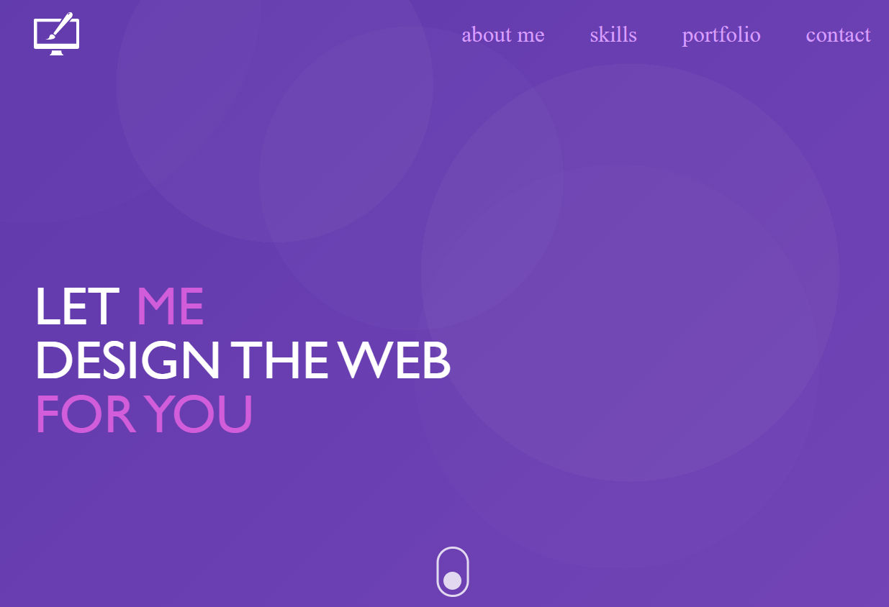

Business Card created in HTML5 and SASS with BEM metodology. Designed in Adobe XD.  
[View Demo](https://nilphym.github.io/Business-Card)

## Table of content
* [General info](#general-info)
* [Screenshots](#screenshots)
* [Technologies](#technologies)
* [Setup](#setup)
* [Features](#features)
* [Changelog](#changelog)
* [Contact](#contact)

## General info
The project firstly was designed in Adobe XD for both mobile and desktop environments.  
When coding I started with whole HTML structure and later moved to building a mobile version according to the mobile first design rule.  
For styling purposes I've used SASS preprocessor with .scss extension so I could use the BEM methodology a lot easier.  
Graphics on the site were created as .svg in Adobe XD so scaling them won't break quality of the image.  

## Screenshots

### Built With
* [HTML5](https://html.spec.whatwg.org)
* [SASS](https://sass-lang.com)
* [Adobe XD](https://www.adobe.com/products/xd.html)
* [JavaScript](https://developer.mozilla.org/en-US/docs/Web/JavaScript)

## Getting Started
To view the website simply: 
* [click here](https://nilphym
* copy the link https://nilphym.github.io/Business-Card paste it to your browser and load it.

## Contact
Created by **Jędrzej Ratajczak** ([@nilphym](https://github.com/nilphym)) - feel free to contact me!
