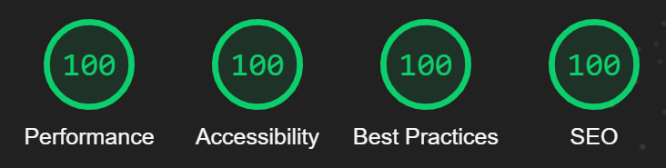

# Business Card
Created in HTML5 and SASS with BEM methodology. Designed in Adobe XD. Fully responsive.  
[View Demo](https://nilphym.github.io/Business-Card)

## Table of content
* [General info](#general-info)
* [Screenshots](#screenshots)
* [Technologies](#technologies)
* [Setup](#setup)
* [Contact](#contact)

## General info
The project was designed in Adobe XD for both mobile and desktop environments.  
Then I started with building a mobile version according to the mobile first design rule.  
For styling purposes I've used SASS preprocessor with .scss extension so I could easily use the BEM methodology.  
All of the graphics on the site were created as .svg in Adobe XD so scaling them won't break the quality of the images.  
Worth to mention - The site passed all of Lighthouse performance, accessibility, best practices and SEO audits.

## Screenshots

## Technologies
* [HTML5](https://html.spec.whatwg.org)
* [SASS](https://sass-lang.com)
* [Adobe XD](https://www.adobe.com/products/xd.html)
* [JavaScript](https://developer.mozilla.org/en-US/docs/Web/JavaScript)

## Setup
To view the website simply [click here](https://nilphym.github.io/Business-Card).

## Contact
Created by **Jędrzej Ratajczak** ([@nilphym](https://github.com/nilphym)) - feel free to contact me!
